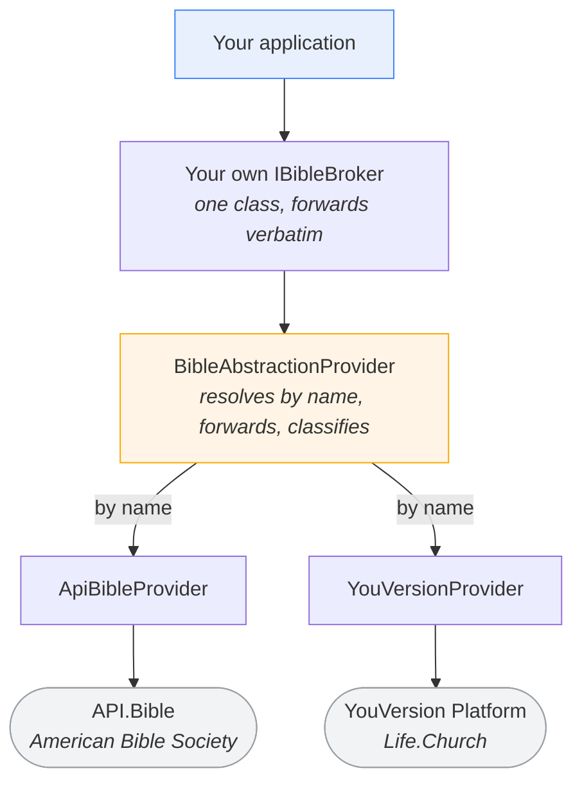

# Glory2Him.BibleProviders


---

> **Pre-release.** The design is complete and reviewed; the implementation is not
> written yet. Every package here is `0.1.0` and nothing is published to NuGet.
> Code samples below describe the designed API, not shipped behaviour.

**Fetch scripture from more than one Bible API behind one contract.**

Ask for `John 3:16` or `JHN.3.16.NIV`, from API.Bible or YouVersion, and get back
the same shape either way — plain text, rich markup, a block model that preserves
red-letter and poetry, the copyright you are obliged to display, and whatever the
rights holder requires you to report.

---

## 🌄 What it is

Three ideas, and the third is the one that makes it worth using.

**One contract.** `IBibleProvider` is the same whichever upstream answers.
`Usfm`, `Reference`, `Translation` and `Text` are identical for a given lookup no
matter who served it — because references are parsed and rendered by this library
rather than echoed from an upstream that makes no promises about their form.

**Two channels, never one.** A provider that *answers* returns a
`ScriptureResult`: found, not found, translation unsupported, reference invalid. A
provider that *cannot answer* throws: rate limited, quota spent, credentials
rejected, upstream down. That split is what makes failover writable — a consumer
can tell "this passage isn't there" (asking another provider is pointless) from
"this provider is unavailable" (asking another is exactly right).

**The licence obligations travel with the scripture.** Attribution, the
per-display reporting token where one is required, the language and its script
direction. Not as a footnote in a wiki — as required members on the passage, so
dropping one is a compile error rather than a compliance incident discovered
months later.

---

## 🧭 How it fits together



The abstraction **resolves which provider answers, by name — and nothing else.**
It never picks between providers, never retries, never inspects a result. Choosing
an order and falling back is an application concern, deliberately, because which
providers exist and under what subscription changes independently of any contract
here.

Inside each provider the layering is the same:


---

## 🛠️ A lookup

```csharp
var configurations = new ApiBibleConfigurations { ApiKey = "…" };
using var provider = new ApiBibleProvider(configurations);

using var bibleProvider = new BibleAbstractionProvider(new[] { provider });

ScriptureResult result = await bibleProvider.GetScriptureByReferenceAsync(
    ApiBibleProvider.ProviderName, "John 3:16", cancellationToken);

if (result.IsFound)
{
    Console.WriteLine(result.Passage.Reference);     // "John 3:16"
    Console.WriteLine(result.Passage.Text);          // never empty on a Found result
    Console.WriteLine(result.Passage.Attribution);   // display this
}
```

Handling the other channel — the one a status check alone will miss:

```csharp
try
{
    ScriptureResult result = await bibleProvider.GetScriptureByUsfmAsync(
        providerName, "JHN.3.16.NIV", cancellationToken);
}
catch (Exception exception) when (exception is IBibleQuotaExceededException quota)
{
    // Stop asking this provider until quota.QuotaResetsOn. Retrying spends an
    // allowance that is already gone.
}
catch (Exception exception) when (exception is IBibleDependencyException)
{
    // Any other unavailability — try the next provider.
}
```

Consumers catch **marker interfaces**, never concrete exception types. That is what
lets your failover handle a provider you hold no reference to.

---

## 📦 Packages

| Package | What it is | Docs |
|---|---|---|
| `Glory2Him.BibleProviders.Abstractions` | The contract, the DTOs, the parsers and the renderer. No HTTP, no DI container | [README](Glory2Him.BibleProviders.Abstractions/README.md) |
| `Glory2Him.BibleProviders.ApiBible` | API.Bible (American Bible Society) | [README](Glory2Him.BibleProviders.ApiBible/README.md) |
| `Glory2Him.BibleProviders.YouVersion` | YouVersion Platform (Life.Church) | [README](Glory2Him.BibleProviders.YouVersion/README.md) |
| `Glory2Him.BibleProviders.ApiBible.Fums` | The FUMS usage reporter. **Not yet created** | — |
| `Glory2Him.BibleProviders.Abstractions.Conformance` | Contract tests a provider inherits. **Not yet created** | — |

Reference `Abstractions` from a domain layer and it brings **two** packages with
it. Reference a provider where you compose the application.

---

## ⚖️ Before you ship

Both upstreams impose obligations on **your** application, not on this library.
The short version; each provider's README carries the detail and the figures.

- **Display the attribution.** It arrives on every passage.
- **API.Bible requires usage reporting on display**, not on fetch — it is a licence
  condition, not analytics. One fetch can produce a thousand displays, or none.
- **Stored scripture is a refreshable cache, not an archive.** API.Bible requires a
  check at least every 30 days, deletion when content is withdrawn upstream, and
  removal within 72 hours of a request or a lapsed subscription.
- **Storing YouVersion scripture is not yet sanctioned** — its platform terms grant
  no rights in the Bible text at all, so the retention question lives in the
  per-version licence you accept in their portal.
- **Size your request budget.** Every lookup is one live upstream call. API.Bible's
  free tier is 5,000 a month — about 165 lookups a day — and past it *service is
  disrupted rather than billed*.

---

## 📚 Documentation

- **[`Documentation/Design/`](Documentation/Design/)** — the full design, in four
  area-scoped documents. Start at [`Design.md`](Documentation/Design/Design.md).
  Sections are prefixed and cited by number (`§ABS6`, `§APB14`) from code comments.
- **[`DEVELOPERS.md`](DEVELOPERS.md)** — how work moves from an idea to merged code
  here, and how to drive the four agents.
- **[`CLAUDE.md`](CLAUDE.md)** — the rules that bind contributors and agents alike.

---

## 🚧 Repository setup still outstanding

Tracked on [#3](https://github.com/Glory2Him/Glory2Him.BibleProviders/issues/3):

- `INTENT.md` — what this system is for, in prose.
- `CLAUDE.md` — trim **Commands** to what exists here, and delete its *Before this
  repository is real* section.

---

## 🤝 Contributing

Pull request titles must start with one of the category prefixes listed in
`.github/workflows/prLinter.yml` (for example `MINOR FOUNDATIONS:` or `DOCUMENTATION:`),
and the description must link an issue with `Closes #<n>`. Both are enforced by CI.

`.github/workflows/*.yml` are **build output** — edit
`Glory2Him.BibleProviders.Infrastructure` and regenerate. A hand-edit is reverted
silently by the next regeneration.

---

## 📜 License

Licensed under the Glory 2 Him Software License (G2HSL). Two files, deliberately:
[LICENSE.txt](LICENSE.txt) is this repository's copy — the licence with the
repository's own name and copyright line on top — and [G2HSL.md](G2HSL.md) is the
licence on its own, unmodified. The canonical copy lives at
[Glory2Him/Glory2Him](https://github.com/Glory2Him/Glory2Him/blob/main/G2HSL.md).

**FREE TO USE TO HELP SHARE THE GOSPEL**

> John 14:6 (NIV) "Jesus answered, 'I am the way and the truth and the life.
> No one comes to the Father except through me.'"
> [john.bible/john-14-6](https://john.bible/john-14-6)

If Jesus is who He said He is, what does that mean for you, today?
